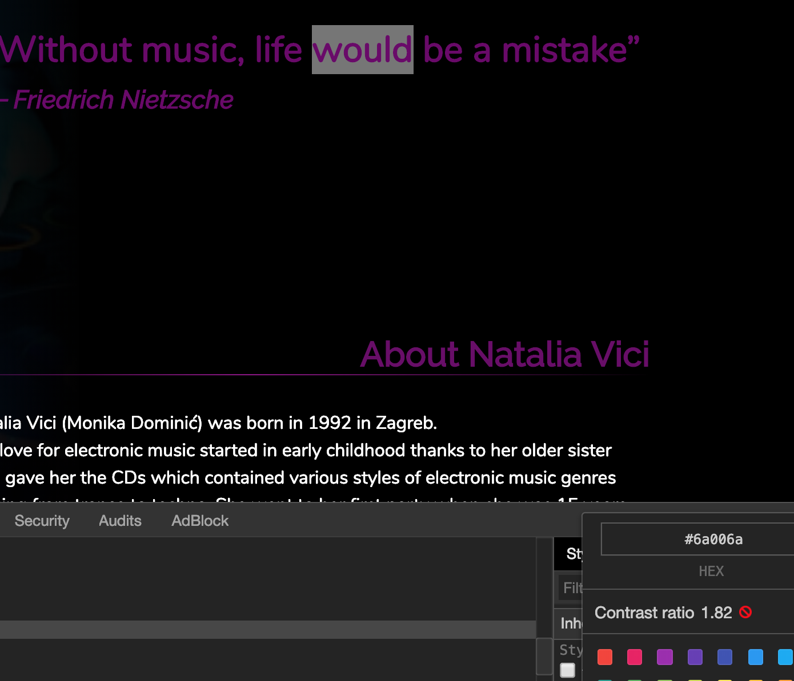

# Breathe Bubble

## Q&A with Lars

1. I think the color you picked is quite nice. Do you use a particular resource to find colors? Or do you keep something like a list of the ones you like?

> I use a mix of resources, personal tweaking and finally I use the colour contrast tool in the Chrome inspector to check if the contrasting values check out.

Note the bottom right corner. You can conjure this menu if you have a colour, then click the square containing the colour and scroll down when you see the colour picker.

)
And notably this colour picker: <https://www.webfx.com/web-design/random-color-picker/>

2. I saw that you use two separate stylesheets. One for the main CSS, and the other for animations. Is this good practice, or personal choice?

> Yes, it’s good to create a separation of stylesheets per component. But personally I also separate media queries and animations into separate stylesheets for clarity.

3. Do you always use the `font-smooth` property?

> Yes, compared to how a font looks on Google Fonts for example and the final result that’s rendered on your page there’s always a huge difference. And that has to do with `font-smoothing`. I don’t like the default smoothing, but whether or not it’s good practice to use all the time is a debated topic <http://usabilitypost.com/2010/08/26/font-smoothing/>. Although most posts you’ll find when you google `font-smoothing` will be in favour of using it <https://medium.com/@MateMarschalko/improving-font-rendering-with-css-3383fc358cbc>

4. How did you come up with hiding and showing the text with animation?

> Hmm, it seemed like the natural way to structure this. Because it doesn’t require a user action, it’s just something that loops. It was a bit tricky to execute though, because functionally and visually the pulse, rotate and text hide/show are the ‘same’ animation. But in CSS you can only animate one element at a time. This seems dangerous, why? Because if any of the individual animations is changed then the timing will be off for all of them. I tried to get around this by using a CSS variable for the timing, like you did too. That way at least the timing is set.

## Lars's List of Resources [🔗](https://docs.google.com/document/d/117kEP9UGKDL8c348ICpNTrZkIeomdyQWt94FLgTiUpM/edit):

### Colours
- <https://www.webpagefx.com/web-design/random-color-picker/#018F3B>
- <https://pigment.shapefactory.co/>
- <http://www.color-hex.com/color-palettes/popular.php>
- <https://coolors.co/>
- <http://colorhunt.co/>
- <https://uigradients.com/#Blush>
- <http://colorsafe.co/>
- <https://color.adobe.com/nl/create/color-wheel/>
- <https://www.brainpickings.org/2012/08/17/goethe-theory-of-colours/>

### Articles
- <https://principles.design/>
- <https://webdesign.tutsplus.com/articles/- <the-truth-about-multiple-h1-tags-in-the-html5-era--webdesign-16824>
- <https://en.wikipedia.org/wiki/Minimum_viable_product>
- <https://airbnb.design/building-a-visual-language/>
- <http://pierrickcalvez.com/journal/a-five-minutes-guide-to-better-typography>
- <https://www.vitsoe.com/gb/about/good-design>
- <https://en.m.wikipedia.org/wiki/Principle_of_least_astonishment>
- <https://moz.com/beginners-guide-to-seo>
- <https://uxplanet.org/functional-minimalism-for-web-design-4290722cddbd>
- <https://journal.designinc.com/-how-to-make-a-logo-for-free-in-about-5-minutes-a4f409176a8e>
- <http://www.darkhorseanalytics.com/blog/data-looks-better-naked>

### Icons
- <http://fontawesome.io/>
- <https://thenounproject.com/>
- <https://nucleoapp.com/>
- <http://www.streamlineicons.com/>
- <http://www.kameleon.pics/>
- <http://give-n-go.co/>

### Toolkits
- <https://www.hellobonsai.com/best-freelance-tools>
- <https://medialabamsterdam.com/toolkit/>
- <https://co-creation.waag.org/>

### Inspiration
- <http://wow-web.co.uk/>
- <http://melaniedaveid.>
- <http://flowingdata.co>
- <https://goodui.org/>
- <http://littlebigdetails.com/>
- <http://www.calltoidea.com/>
- <http://www.losttype.com/>
- <http://collectui.com/>
- <https://tympanus.net/codrops/>
- <https://sidebar.io/>
- <https://2.cargocollective.com/>
- <https://www.casestudy.club/>
- <https://trendy.af/>
- <https://www.apple.com/iphone/photography-how-to/>

### Tools
- <https://material.io/resizer/>
- <http://www.innovationmanagement.se/imtool-articles/how-to-using-a-morphological-matrix-to-generate-ideas/>
- <https://airbnb.design/lottie/#get-started>
- <https://uxchecklist.github.io/>

### Royalty Free Video
- <http://coverr.co/>
- <http://mazwai.com/#/>

### Fonts
- <https://fonts.google.com/>
- <http://fontpair.co/>
- <http://pierrickcalvez.com/journal/a-five-minutes-guide-to-better-typography>
- <https://www.reliablepsd.com/ultimate-google-font-pairings/>

### Checklist
- <https://uxchecklist.github.io/>

## Notes from Stéphane

Yes, this is a nice practical idea that'll let you understand many things:

* Events (creating and listening to them)
* Associate sound (thus learning what an API is and how the audio API works)
* DOM handling

Also, you'll get a chance to look into CSS animation – `keyframes` etc.

CSS animations are optimised by browsers and thus are less hacky than JS-based animations.

The `object.property`, `object.method()` is the single most important concept in JS, and this is how you'll write your own objects.

This is, also, how you talk with the DOM, and how you'll end up talking with an audio object that will handle the breathe-in, breathe-out sounds.

## Resources

- [Recreating the Apple Watch Breathe App Animation](https://css-tricks.com/recreating-apple-watch-breathe-app-animation/)

### Examples of Breathe Bubble

- [Calm's Breathe Bubble](https://twitter.com/calm/status/1090371889220997120)

- [Calm's Breathe Bubble - YouTube](https://www.youtube.com/watch?v=5DqTuWve9t8)

- [Calm's Breathe Bubble - Simple Version](https://www.calm.com/breathe)

### Learning Examples and Articles

- CSS variables
[30 Day Vanilla JS Coding Challenge - Playing with CSS Variables and JS](https://javascript30.com/)

- Easing functionshttps://css-tricks.com/recreating-apple-watch-breathe-app-animation/
<https://css-tricks.com/ease-out-in-ease-in-out/>

- `font-smoothing` property
[Font Smoothing Explained](https://szafranek.net/blog/2009/02/22/font-smoothing-explained/)

- [Improving font rendering with CSS](https://medium.com/@MateMarschalko/improving-font-rendering-with-css-3383fc358cbc)

- [font-smooth](https://developer.mozilla.org/en-US/docs/Web/CSS/font-smooth)

- [What is the best font color for text on a white background screen?](https://www.quora.com/What-is-the-best-font-color-for-text-on-a-white-background-screen-Are-there-any-studies-to-back-this-up-in-terms-of-optimal-readability)

- [animation-play-state](https://tympanus.net/codrops/css_reference/animation-play-state/)

### More
- [Accessibility Inspector
](https://developer.mozilla.org/en-US/docs/Tools/Accessibility_inspector)
